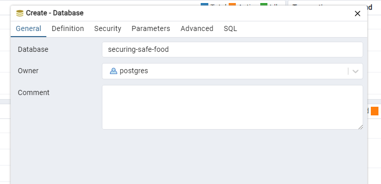

## Backend Setup

This part can be a little tricky! If you run into some confusing errors along the way, don't be afraid to reach out if have any trouble!

You'll need to download:

1. [PostgreSQL](https://www.postgresql.org/download/)
2. [PgAdmin 4](https://www.pgadmin.org/download/) (if PostgreSQL didn't come with it)

Then, set up a database called `securing-safe-food`. If you're not familiar with how to do so, it's easy to do through PgAdmin

1. Open PgAdmin and configure your credentials (if necessary). Then, right click on the `Databases` dropdown (under `Servers` > `PostgreSQL [version]`)
   


2. Enter "securing-safe-food" as the database name
   


Next, create a file called `.env` in the **root directory** (under `ssf/`) and copy over the contents from `.env.example`. Replace `DATABASE_PASSWORD` with the password you entered for the `postgres` user (NOT necessarily your PgAdmin master password!)

You can check that your database connection details are correct by running `nx serve backend` - if you can see the following line in the terminal, then you've got it right!

```
"LOG 🚀 Application is running on: http://localhost:3000/api"
```

Finally, run `yarn run typeorm:migrate` to load all the tables into your database. If everything is set up correctly, you should see "Migration ... has been  executed successfully." in the terminal.