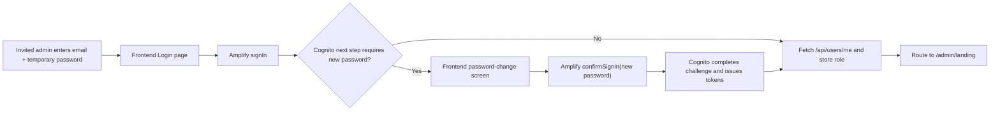

# Authentication And Admin Provisioning Plan

## Why This Rewrite Exists

The original draft assumes the codebase already has a backend-driven Cognito orchestration layer for admin creation and first-login challenge handling. After tracing the frontend and backend, that is not the current architecture.

Today:

- The frontend signs users directly into AWS Cognito with Amplify.
- The frontend sends the Cognito JWT to the Nest backend on API calls.
- The backend validates the JWT against Cognito JWKS and then looks up the BHCHP user record in Postgres to determine the app role.
- Route authorization is enforced from the database `User.userType`, not from Cognito groups or custom claims.
- The "Create Admin" screen is currently UI-only and does not call the backend or Cognito yet.

Because of that, the correct plan is not "add one missing rollback around an existing auth service." The correct plan is "introduce a new admin-provisioning path into an app that currently uses Cognito only for sign-in and uses the database as the source of truth for roles."

## Current Auth Flow In The Codebase

### Frontend login and session resolution

1. App startup calls `configureAmplify()` once in [apps/frontend/src/main.tsx](../apps/frontend/src/main.tsx) and [apps/frontend/src/auth/amplify.ts](../apps/frontend/src/auth/amplify.ts).
2. The login page in [apps/frontend/src/containers/login.tsx](../apps/frontend/src/containers/login.tsx) calls `signInWithEmailPassword()`.
3. `signInWithEmailPassword()` in [apps/frontend/src/auth/cognito.ts](../apps/frontend/src/auth/cognito.ts) delegates directly to Amplify `signIn`.
4. After Cognito accepts the credentials, the login page calls `fetchAndStoreCurrentSessionUserType()`.
5. `fetchAndStoreCurrentSessionUserType()` in [apps/frontend/src/auth/current-session-user-type.ts](../apps/frontend/src/auth/current-session-user-type.ts):
   - reads Cognito user attributes with `fetchUserAttributes()`
   - calls `GET /api/users/me`
   - stores `user.userType` in `sessionStorage`
6. Frontend route guards use:
   - `RequireAuth` to check whether a Cognito session exists
   - `RequireRole` to resolve the BHCHP role from cached storage or `GET /api/users/me`

### Frontend token attachment

1. `ApiClient` in [apps/frontend/src/api/apiClient.ts](../apps/frontend/src/api/apiClient.ts) adds an Axios request interceptor.
2. Before each request, it calls `getIdToken()`.
3. `getIdToken()` retrieves the current Cognito ID token via Amplify `fetchAuthSession()`.
4. The token is sent as `Authorization: Bearer <idToken>`.

### Backend authentication and authorization

1. Protected controllers use `AuthGuard('jwt')`.
2. `JwtStrategy` in [apps/backend/src/auth/jwt.strategy.ts](../apps/backend/src/auth/jwt.strategy.ts):
   - validates the Cognito JWT using the user pool JWKS
   - accepts the configured Cognito app client IDs as audiences
   - returns `{ idUser: payload.sub, email: payload.email }`
3. `CurrentUserInterceptor` in [apps/backend/src/interceptors/current-user.interceptor.ts](../apps/backend/src/interceptors/current-user.interceptor.ts) reloads the database `User` by email and replaces `request.user` when a match exists.
4. `RolesGuard` in [apps/backend/src/auth/roles.guard.ts](../apps/backend/src/auth/roles.guard.ts) fetches the database user again and enforces `@Roles(...)`.
5. The backend therefore treats Cognito as identity proof, but Postgres `user.userType` as authorization truth.

### Backend endpoints currently involved in auth-dependent flows

- `GET /api/users/me` returns the current database user in [apps/backend/src/users/users.controller.ts](../apps/backend/src/users/users.controller.ts)
- `GET /api/applications/me` returns the standard user's application in [apps/backend/src/applications/applications.controller.ts](../apps/backend/src/applications/applications.controller.ts)
- Admin-only routes such as `GET /api/users/email/:email`, `GET /api/applications`, and `PATCH /api/applications/:appId/status` rely on the same JWT + DB-role pattern

## Gaps Between The Draft And The Actual Codebase

The original draft needs to be adjusted in these ways:

- There is no current backend `auth.service.ts` implementing admin provisioning in this repo.
- There is no backend login endpoint; first login is handled by the frontend talking directly to Cognito.
- There is no current frontend handling for Cognito `NEW_PASSWORD_REQUIRED`.
- There is no API client method wired to create an admin.
- The current `CreateNewAdmin` page is a stub that only shows a success toast.
- The existing authorization model depends on database `User` records, so a Cognito-only admin account is insufficient even if Cognito creation succeeds.

## Recommended Implementation Plan

### Phase 1: Keep the current sign-in architecture and add admin provisioning behind it

Do not move login into the backend. Keep the existing architecture where:

- frontend authenticates with Cognito directly
- frontend sends Cognito JWTs to the backend
- backend validates JWTs and resolves app roles from Postgres

This minimizes change and fits the current codebase.

### Phase 2: Add a backend admin-provisioning service

Create a backend service, likely under `apps/backend/src/auth` or a new admin-provisioning module, that owns:

- `generateTemporaryPassword()`
- `createAdminUserInCognito(email, temporaryPassword)`
- `deleteAdminUserInCognito(email)`
- `createAdminDatabaseRecords(email, firstName, lastName, discipline)`
- `provisionAdmin(...)`
- optional `resendAdminInvite(email)`

This service should be the only layer allowed to coordinate Cognito plus database writes.
The frontend should never generate or submit the temporary password.

### Phase 3: Add a protected backend endpoint for admin creation

Add a route that is callable only by authenticated admins, for example:

- `POST /api/admins/provision`

Expected request body:

- `email`
- `firstName`
- `lastName`
- `discipline`

Authorization model:

- `AuthGuard('jwt')`
- `RolesGuard`
- `@Roles(UserType.ADMIN)`

This matches how the rest of the backend already protects privileged operations.

### Phase 4: Make the database write transactional

Inside the backend, create both BHCHP records inside a single database transaction:

- `User` with `userType = ADMIN`
- `AdminInfo` with the selected discipline

If the database transaction fails, do not commit either record.

This preserves the repo's current rule that database-backed role data is the source of truth for authorization.

### Phase 5: Coordinate Cognito and Postgres with explicit compensation

Because Cognito and Postgres cannot share a single distributed transaction, the provisioning sequence should be:

1. Validate input and reject duplicates early when possible.
2. Generate the temporary password on the backend.
3. Create the Cognito user.
4. Let Cognito deliver the invitation email as part of `AdminCreateUser`.
5. Attempt the Postgres transaction for `User` + `AdminInfo`.
6. If the Postgres transaction fails after Cognito creation, immediately try to delete the Cognito user.
7. Return a failure response if either the DB write fails or compensation fails.

Expected behavior by failure case:

- Cognito fails first: nothing is written to Postgres.
- Postgres fails after Cognito succeeds: attempt Cognito rollback with `AdminDeleteUser`.
- Cognito rollback fails: surface a high-severity server error and log that manual cleanup is required.

This is the right place for the rollback logic from the original draft, but it must live in a brand-new provisioning path, not as a small patch to an already-existing flow.

Password-handling rule:

- the temporary password should be generated only on the backend
- it should not be accepted from the frontend request body
- it should only be sent from the backend to Cognito

Email-delivery decision:

- Use Cognito `AdminCreateUser` with its built-in invitation flow so Cognito sends the temporary password email.
- Do not add a custom SES email path unless a concrete product requirement forces that complexity later.

### Phase 6: Wire the frontend Create Admin screen to the new endpoint

Update [apps/frontend/src/containers/CreateNewAdmin.tsx](../apps/frontend/src/containers/CreateNewAdmin.tsx) so confirmation actually calls the backend.

Frontend changes:

- add `apiClient.provisionAdmin(...)`
- submit the form to the new backend endpoint
- show loading, success, and failure states
- keep the page behind existing admin-only route guards

Important behavior:

- do not show success until the backend confirms both Cognito creation and database creation succeeded
- if the backend returns a partial-failure error, show a generic error to the user and rely on server logs for cleanup detail

### Phase 7: Add first-login challenge handling for invited admins

The current frontend login flow assumes plain successful sign-in. That is not enough for Cognito `AdminCreateUser`, which typically returns a `NEW_PASSWORD_REQUIRED` challenge on first login.

To support invited admins without rewriting the architecture:

1. Update the frontend sign-in wrapper to inspect Amplify's sign-in result.
2. If Cognito returns a next step equivalent to `CONFIRM_SIGN_IN_WITH_NEW_PASSWORD_REQUIRED`, route the user to a "set your password" screen instead of treating sign-in as complete.
3. Submit the chosen password with Amplify `confirmSignIn`, not a custom backend endpoint, unless the team has a strong reason to move challenge handling server-side.
4. After password confirmation completes, run the existing `fetchAndStoreCurrentSessionUserType()` step and proceed with normal routing.

This is the biggest place where the original draft diverges from the codebase: the draft assumes a backend `handleNewPasswordChallenge(...)` endpoint, but the current repo already uses direct frontend Cognito auth, so the simplest codebase-aligned plan is to keep challenge completion in the frontend too.

### Phase 8: Optionally add resend-invite support

If the product needs it, add:

- backend: `POST /api/admins/:email/resend-invite`
- frontend: admin action from the Create Admin flow or admin detail view

This should also be admin-only and should call Cognito from the backend, because it is an administrative action rather than a self-service sign-in action.

### Phase 9: Add logging, tests, and operational guardrails

Add:

- backend unit tests for provisioning success, DB failure with Cognito rollback, and unauthorized access
- frontend tests for Create Admin submit success/failure
- frontend tests for first-login password-change challenge handling
- structured backend logging around Cognito create/delete attempts
- alertable logs when Cognito rollback fails

## Call Flow Diagram

### Current auth flow

```mermaid
flowchart LR
    A["User enters email + password"] --> B["Frontend Login page"]
    B --> C["Amplify signIn(username, password)"]
    C --> D["AWS Cognito"]
    D --> E["Amplify session stores Cognito tokens"]
    E --> F["Frontend calls GET /api/users/me"]
    F --> G["Axios interceptor attaches Cognito ID token"]
    G --> H["Nest AuthGuard(jwt)"]
    H --> I["JwtStrategy validates JWT against Cognito JWKS"]
    I --> J["CurrentUserInterceptor loads DB user by email"]
    J --> K["UsersController returns DB user"]
    K --> L["Frontend caches userType in sessionStorage"]
    L --> M["Route guards redirect to admin or candidate area"]
```

### Proposed admin provisioning flow

```mermaid
flowchart LR
    A["Authenticated admin on /admin/create"] --> B["Frontend CreateNewAdmin form"]
    B --> C["POST /api/admins/provision"]
    C --> D["Axios interceptor attaches Cognito ID token"]
    D --> E["Nest AuthGuard(jwt) + RolesGuard(ADMIN)"]
    E --> F["AdminProvisioningService"]
    F --> G["Cognito AdminCreateUser"]
    G --> H["Begin DB transaction"]
    H --> I["Insert User(userType=ADMIN)"]
    I --> J["Insert AdminInfo"]
    J --> K{"DB transaction succeeds?"}
    K -->|Yes| L["Commit transaction"]
    L --> M["Return success to frontend"]
    K -->|No| N["Attempt Cognito AdminDeleteUser rollback"]
    N --> O{"Rollback succeeds?"}
    O -->|Yes| P["Return failure; nothing persists in DB"]
    O -->|No| Q["Return failure and log manual cleanup required"]
```

### Proposed first invited-admin login flow

## Concrete Scope Recommendation

If the team wants the smallest useful delivery, implement these items first:

1. Backend `POST /api/admins/provision` with Cognito create plus transactional DB writes plus compensation.
2. Frontend `CreateNewAdmin` wiring to that endpoint.
3. Frontend handling for Cognito first-login password change.

Everything else is optional follow-on work.

## Notes And Assumptions

- This rewrite assumes the app should continue using Cognito as the identity provider and Postgres `User.userType` as the authorization source of truth, because that is how the current codebase is built.
- This rewrite intentionally does not recommend storing admin role state in Cognito groups because nothing in the current backend authorization path reads Cognito groups.
- The current frontend sends the Cognito ID token to the backend. The backend strategy is therefore effectively depending on an ID token that contains `email`, not on a Cognito access token.
